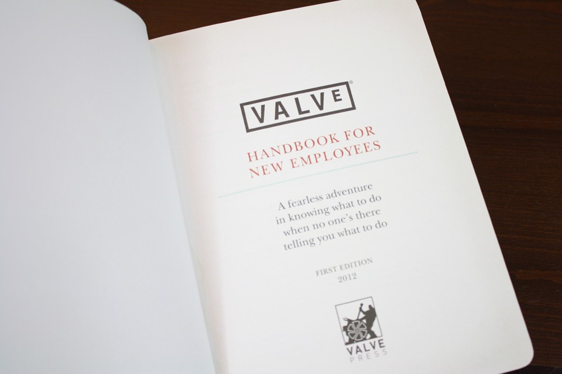
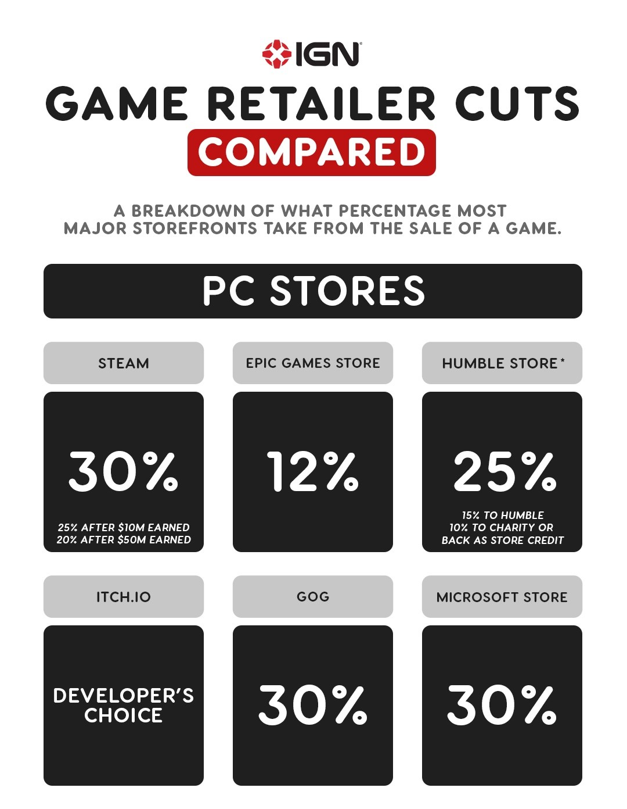
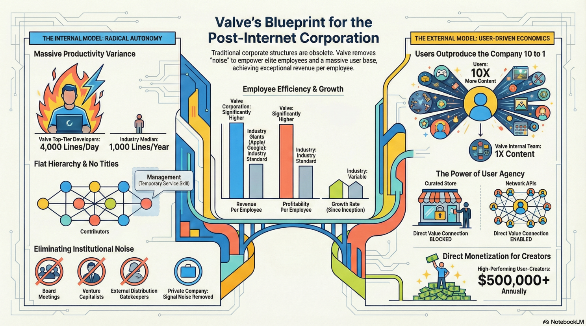

import Callout from "@/components/Callout.astro";

---

He lives primarily at sea and acquired the Dutch custom superyacht builder **Oceanco** in August 2025. He co-founded the companies that work on maritime and neuroscience projects. And he was a key producer for the first three versions of Windows.

I'm talking about **Gabe Newell**, the co-founder and president of **Valve Corporation**. Valve is a company that produces both software and hardware for gamers. Approximately 75% of all computer games worldwide are sold through Valve's **Steam** platform. In 2025, the company generated an estimated $17 billion in gross revenue with only 330 to 360 employees. (This amounts to around $50 million in revenue per employee, which significantly exceeds Apple's $2.4 million and Meta's $1.9 million per employee.)

> In essence, Valve has become the powerhouse of the gaming industry, much like how Apple Inc. transformed the world of personal computers in the 1980s

And as of 2026, Gabe is recognised as the wealthiest person in the video game industry, with an estimated net worth of $11 billion. So, I couldn't help but check his interviews, looking for the business lessons I could learn from him.

## The 6 principles I found:

### 1. Prioritise High-Value Talent over Low-Cost Labour

Newell argues that the typical corporate move toward outsourcing to find the lowest-cost labour is the "exact opposite" of what companies should do. Valve hires the most expensive, highly productive talent because these individuals are often the least correctly valued by the market relative to the massive value they create.

Business success stems from the fundamental ability to attract and retain these high-producers by paying them based on the actual value they generate.

### 2. Structure the Organisation to Eliminate Friction

Valve is a truly horizontal organisation. Employees operate without titles, which can prevent them from using their full range of skills. Management is a temporary service skill, not a career path (and it is often treated as a "stressful job" that employees may rotate out of after a project)

And even desks are on wheels there, allowing employees to reorganise their entire office space in 15 minutes to join a new project group.

### 3. Establish a Direct, "Noise-Free" Signal with Customers

Valve remains privately held to avoid the interference of venture capitalists, board meetings, and external approval processes that distance developers from customers.

Newell learned from Microsoft’s early history that indirect channels (like resellers) leave companies "blind" to how their products are actually used. He notes that a small 12-person company like ID Software (creators of Doom) was able to out-distribute Microsoft because they had a more direct connection to user value.

### 4. Don’t Compete with Your Customers

One of Newell’s most significant realisations is that a company’s user base is more productive at creating content than the company itself.

> In games like Team Fortress 2, users produce ten times more content than Valve’s internal team, according to Gabe Newell.
Newell believes Valve’s job is to stop being a "curated store" (a bottleneck) and instead become a network API that allows users to publish content, create their own stores, and monetise their creativity.

He supports creating systems that let users sell goods directly to each other. Some top creators can earn up to $500,000 a year. Valve takes a commission of up to 30%, which helps generate a significant amount of revenue.

### 5. Demand Quantitative Predictions

For Newell, "serious" engineering and business work require making quantitative predictions in advance.

He asserts that anyone can explain a result after the fact, but true rigor comes from predicting how a system perturbation will change customer behavior before it happens. He suggests that prediction markets are vastly more reliable for forecasting outcomes, such as game sales, than a publisher's internal market services.

### 6. Adapt to Technological Transitions

Newell highlights the importance of identifying and capitalizing on major technology shifts, such as the move from pre-internet to post-internet.

AI, along with machine learning, serves as today's "cheat code," playing a pivotal role in the ongoing transition that will significantly influence all sectors, from law to boat captaining.

He also embraces his role at Valve as an opportunity to champion long-term, high-risk innovations, like brain-computer interfaces, paving the way for others with his proven track record of transformative success.

---

## Sources
- https://youtu.be/Td_PGkfIdIQ?si=N8QmxQsjuKoZ7_0y
- https://youtu.be/oFHXIW37NBM?si=G5QiV_yaB76Fr87K
- https://youtu.be/9kO6Dj2XNfY?si=9kH0S-XMsFAHOh65
