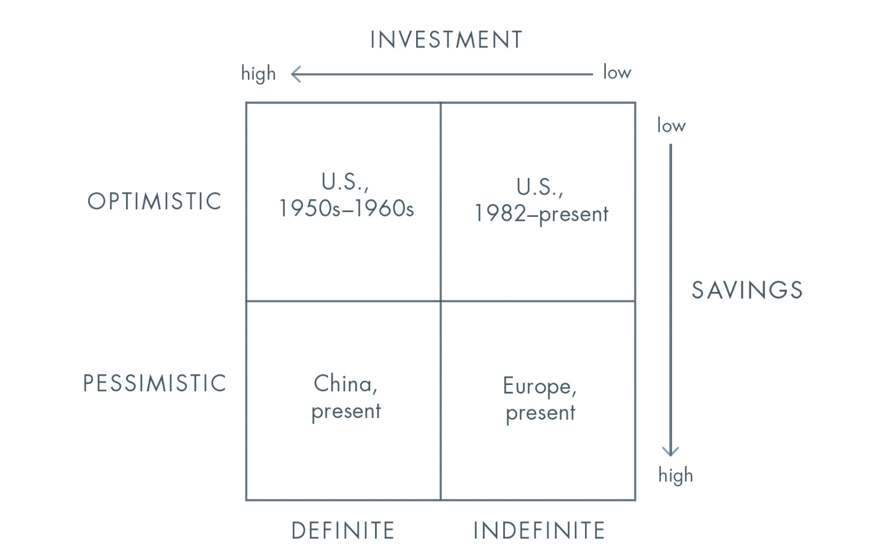
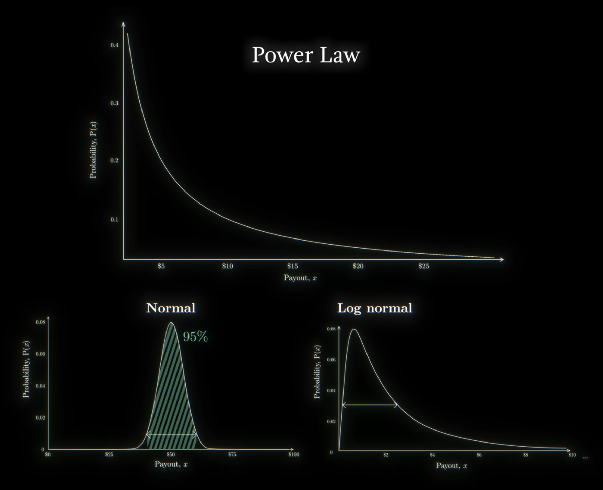

import Callout from "@/components/Callout.astro";

---

## My Review

*While I may not always agree with Peter Thiel, I find his intelligence and the intellectual stimulation of our imaginable debates to be quite enjoyable*

*For instance, I disagree with Thiel’s assessment of Monopoly. However, I’m curious to know why he believes it’s good. I revisited my own values to challenge his perspective*

*But it’s not just that. As an entrepreneur, I’ve learned a great deal from Thiel’s insights on startups and product development. At least for that reason, I highly recommend this book and consider it worth reading*

---
## Main Ideas

Zero to One argues that true progress comes not from copying what already exists (going from 1 to n), but from creating something fundamentally new (going from 0 to 1)

The book presents a bold thesis: the future is shaped by founders who reject randomness, avoid competition, and build unique companies grounded in strong foundations, coherent teams, durable monopolies, and visionary plans

### The Seven Questions every business must answer

Thiel suggests asking yourself these seven essential questions that test whether a company can move from zero to one:

1. **The engineering question**: Can your product outperform existing solutions by 10-20 times?
2. **The timing question**: Is now the right moment to start your business?
3. **The monopoly question**: Are you capturing a large share of a small market rather than aiming too big?
4. **The people question**: Do you have the right team?
5. **The distribution question**: Do you have a top-notch way to distribute your product?
6. **The durability question**: Can you maintain your market position in 10-20 years?
7. **The secret question**: Have you discovered a unique opportunity others haven't seen?

> If you nail all seven, you’ll master fortune and succeed. Even getting five or six correct might work.

### Start Small to Dominate

The ideal starting point is a niche with concentrated customers and few competitors. From there, a company can expand deliberately into adjacent markets

<Callout type="book"> 
    Paradoxically, this idea is quite similar to what Sahil Lavinia projects in his book "Minimalist Entrepreneur," which is building businesses to help relatively small communities
</Callout>

Every successful company begins by dominating a very small, specific market. Attempting to capture a fraction of a massive market leads to competition and mediocrity

> If you think your initial market might be too big, it almost certainly is.

The goal is not to make the final great innovation in a market and enjoy durable profits

### Sales and Distribution Matter as Much as Product

Engineers often underestimate sales. But even the best product will fail without strong distribution

A company must understand customer acquisition costs, lifetime value, viral loops, and scalable sales processes

> Selling and delivering a product is at least as important as the product itself.

The best sales is often invisible, but it is never optional

### Definite Optimism vs. Indefinite Drift

Thiel distinguishes four views of the future as perceived by a society: definite optimism, indefinite optimism, definite pessimism, and indefinite pessimism:

The central argument is that modern society (especially the United States since 1982) has shifted from definite optimism (planning and building boldly) to indefinite optimism (expecting progress without concrete plans)

Finance thrives in indefinite worlds because money becomes an end rather than a means. In contrast, engineering and invention thrive in definite futures where people actively shape outcomes

> Indefinite optimism seems inherently unsustainable: how can the future get better if no one plans for it?

The entrepreneur’s task is to reject chance and consciously build the future

### The Power Law and Singular Focus

Thiel introduces [the power law](https://en.wikipedia.org/wiki/Power_law): a small number of investments create the majority of returns. This applies to venture capital, to careers and startups

<Callout type="info">
    The illustration above, from Veritasium's popular [YouTube channel](https://youtu.be/HBluLfX2F_k?si=dSvO51xssgBIJKxf), beautifully explains the Power Law:
    <iframe src="https://www.youtube.com/embed/HBluLfX2F_k?si=NmOyLyAkWdB0Ohdl" title="YouTube video player" class="pt-2" frameborder="0" allow="accelerometer; autoplay; clipboard-write; encrypted-media; gyroscope; picture-in-picture; web-share" referrerpolicy="strict-origin-when-cross-origin" allowfullscreen></iframe>
</Callout>

Diversification may reduce risk in finance, but it dilutes impact in entrepreneurship. Founders and individuals must commit deeply to one project rather than hedge endlessly

> We don’t live in a normal world; we live under a power law.

Success requires concentrated effort on something that will matter in the future

### From Competition to Monopoly: Creating Unique Value

Thiel argues that competition destroys profits and distracts companies from meaningful innovation. Lasting value is created by monopolies — firms that solve unique problems and escape competition

Competition leads firms to focus on rivals instead of customers or long-term vision. True progress happens when entrepreneurs build something so different that it creates its own category

> All happy companies are different: each one earns a monopoly by solving a unique problem.

Monopolies are built through proprietary technology (10x better solutions), network effects, economies of scale, and branding (but brand without substance is dangerous)

### Strong Foundations: Teams, Ownership, and Culture

A startup’s early structure determines its destiny. Founders must align ownership, control, and incentives. Cash compensation encourages short-term thinking, while equity aligns people with long-term value creation

> Anyone who prefers owning a part of your company to being paid in cash reveals a preference for the long term.

Teams should work closely together, share history, and maintain full-time commitment. <mark>Culture is the company itself</mark>

Misalignment and internal conflict destroy companies from within

### Contrarian Thinking and Secrets

Progress depends on discovering truths about nature or society that others have not recognized (aka secrets)

Modern culture often assumes that everything important has already been discovered. Thiel rejects this. He argues that great companies are built around hidden insights

> Whenever I interview someone for a job, I like to ask this question: "What important truth do very few people agree with you on?"

> Every great business is built around a secret that’s hidden from the outside.

Entrepreneurs must endure being “lonely but right.” Innovation demands independent thought rather than imitation
